# App Moneda (Actividad)

## Descripción
Aplicación móvil desarrollada en Android Studio para convertir de dolares a soles y viceversa

---

## Actividad Inicial

**Interfaz**  
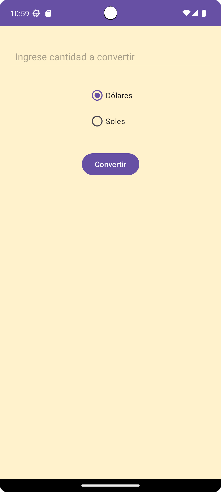

**Cambio de soles a dolares**  
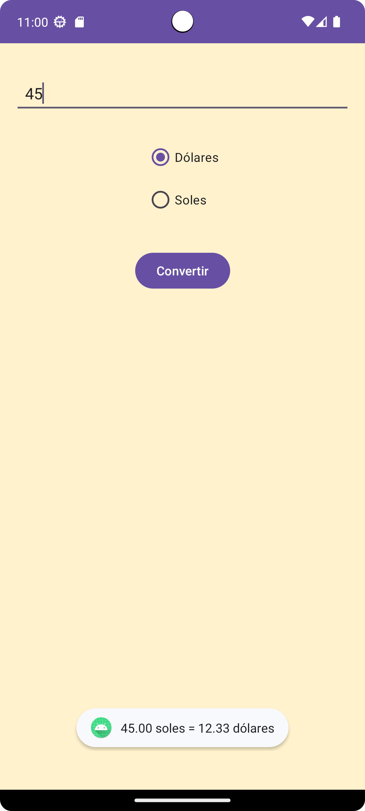

---

## Ejercicio 1 – App Moneda2

**Interfaz**  
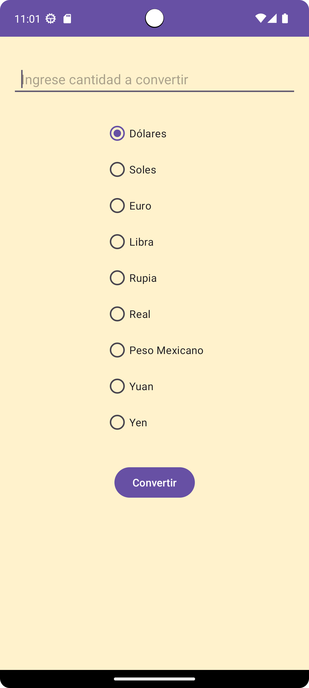

**Conversion de Dolares a Soles**  
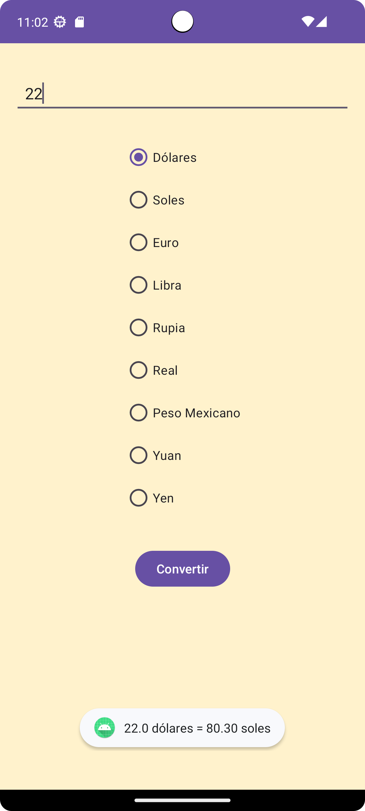

**Conversion de Soles a Dolares**  

**Conversion de Euro a Soles**  
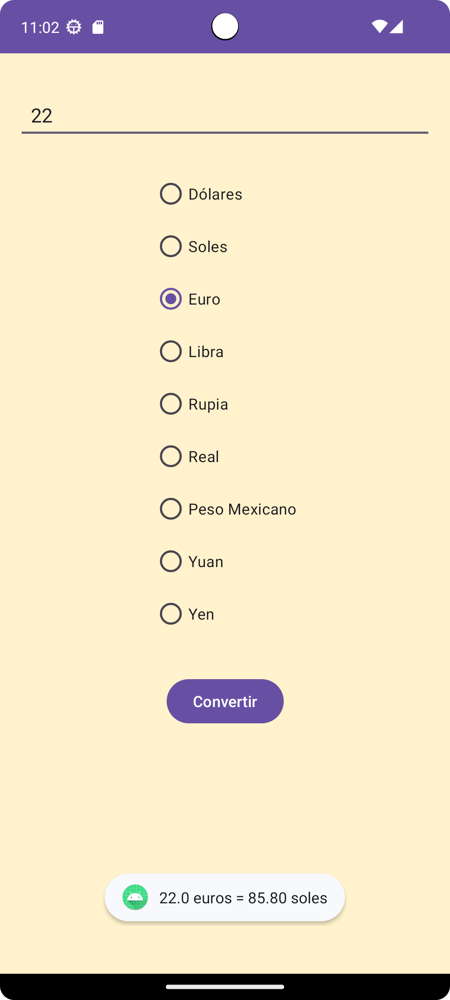

**Conversion de Libra a Soles**  

**Conversion de Rupia a Soles**  
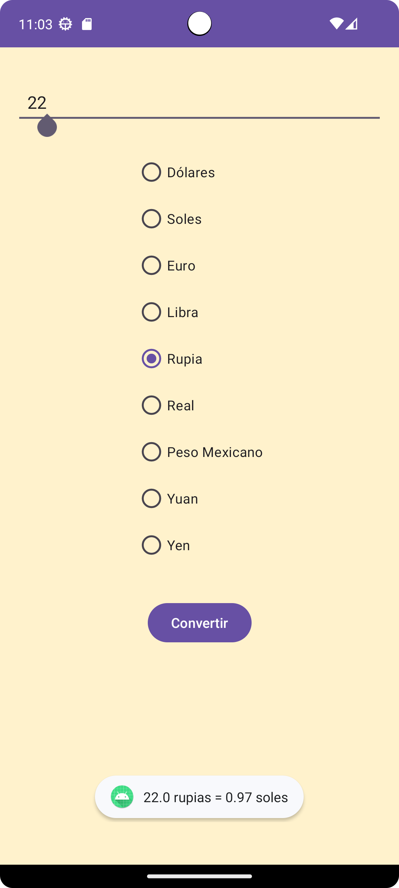

**Conversion de Real a Soles**  
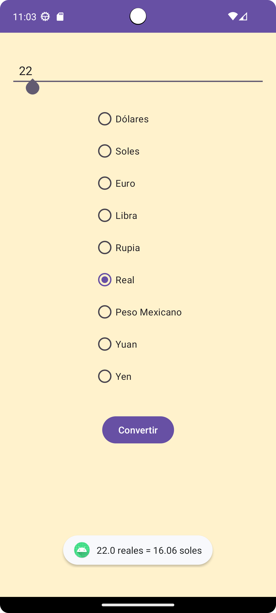

**Conversion de Peso Mexicano a Soles**  

**Conversion de Yuan a Soles**  

**Conversion de Yen a Soles**  

**Validacion de campo vacio**  
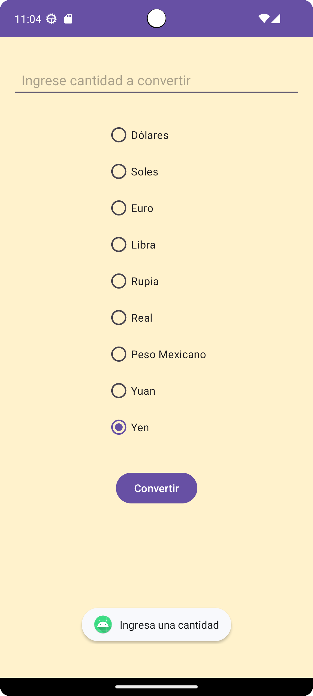

---

## Ejercicio 2 – App Pizza

**Interfaz de Inicio**  
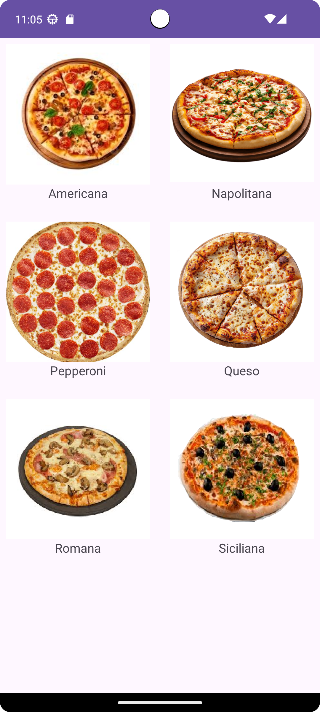

**Mensaje de seleccion Pizza Americana**  
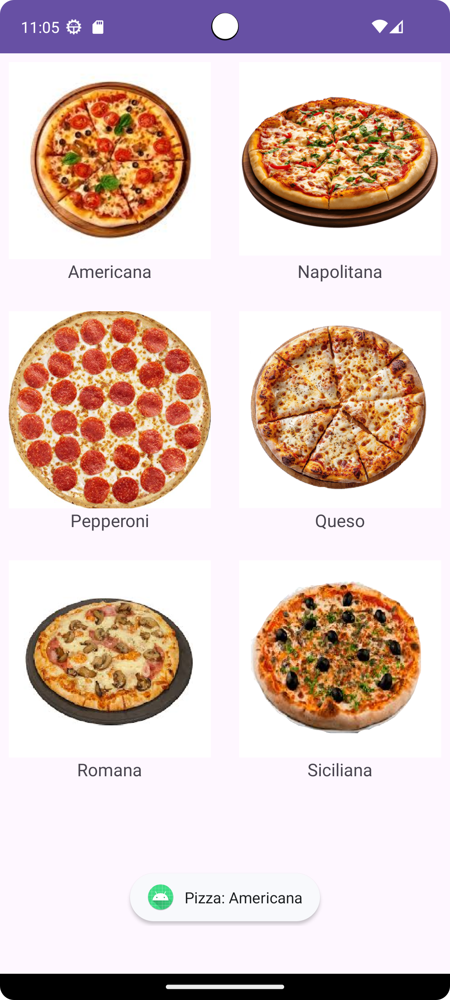

---

## Ejercicio 3 – App Dado

**Interfaz de Inicio**  
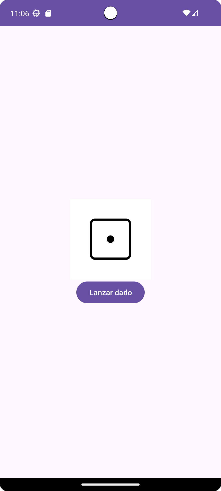

**Boton para escoger una cara al alzar prueba 1**  

**Boton para escoger una cara al alzar prueba 2**  
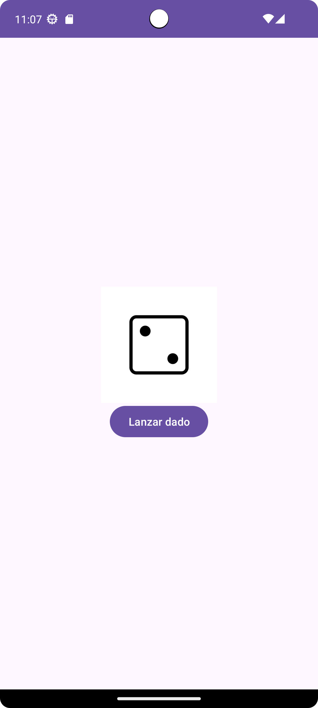

**Boton para escoger una cara al alzar prueba 3**  
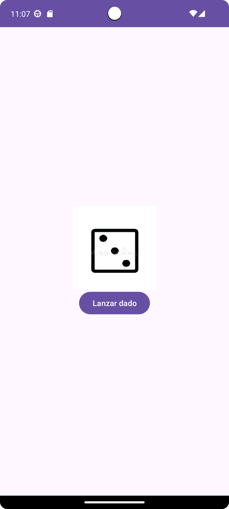

---

